# Configuration Evolution Report

**Generated**: 2025-09-06T15:23:00.254073
**Total Configurations**: 14

## Evolution Graph

```mermaid
graph TD
    precision_outlier_focused.env["precision outlier focused"]
    precision_evidence_filter.env["precision evidence filter"]
    precision_focused.env["precision focused"]
    precision_aggressive_debug.env["precision aggressive debug"]
    precision_optimized_bedrock.env["precision optimized bedrock"]
    precision_final_push.env["precision final push"]
    precision_percentile_mode.env["precision percentile mode"]
    current_best.env["current best"]
    recall_optimized_bedrock.env["recall optimized bedrock"]
    precision_elevated.env["precision elevated"]
    precision_optimization_grid.env["precision optimization grid"]
    precision_optimized_bedrock_correct.env["precision optimized bedrock correct"]
    stable_bedrock.env["stable bedrock"]
    precision_push.env["precision push"]
    precision_optimized_bedrock.env --> precision_elevated.env
```

## Configuration Details

### precision_outlier_focused.env

- **Created**: Unknown
- **Objective**: Unknown
- **Has Metadata**: No

### precision_evidence_filter.env

- **Created**: Unknown
- **Objective**: Unknown
- **Has Metadata**: No

### precision_focused.env

- **Created**: Unknown
- **Objective**: Unknown
- **Has Metadata**: No

### precision_aggressive_debug.env

- **Created**: Unknown
- **Objective**: Unknown
- **Has Metadata**: No

### precision_optimized_bedrock.env

- **Created**: Unknown
- **Objective**: Unknown
- **Has Metadata**: No

### precision_final_push.env

- **Created**: Unknown
- **Objective**: Unknown
- **Has Metadata**: No

### precision_percentile_mode.env

- **Created**: Unknown
- **Objective**: Unknown
- **Has Metadata**: No

### current_best.env

- **Created**: Unknown
- **Objective**: Unknown
- **Has Metadata**: No

### recall_optimized_bedrock.env

- **Created**: Unknown
- **Objective**: Unknown
- **Has Metadata**: No

### precision_elevated.env

- **Created**: 2025-09-06T20:15:00+00:00
- **Objective**: precision
- **Has Metadata**: Yes

### precision_optimization_grid.env

- **Created**: Unknown
- **Objective**: Unknown
- **Has Metadata**: No

### precision_optimized_bedrock_correct.env

- **Created**: Unknown
- **Objective**: Unknown
- **Has Metadata**: No

### stable_bedrock.env

- **Created**: Unknown
- **Objective**: Unknown
- **Has Metadata**: No

### precision_push.env

- **Created**: Unknown
- **Objective**: Unknown
- **Has Metadata**: No

## Evolution Relationships

| From | To | Rationale |
|------|----|-----------|
| precision_optimized_bedrock.env | precision_elevated.env | Optimize precision while maintaining recall baseline |